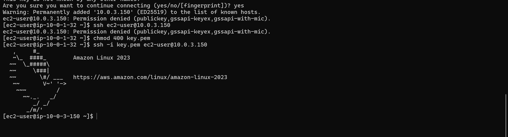
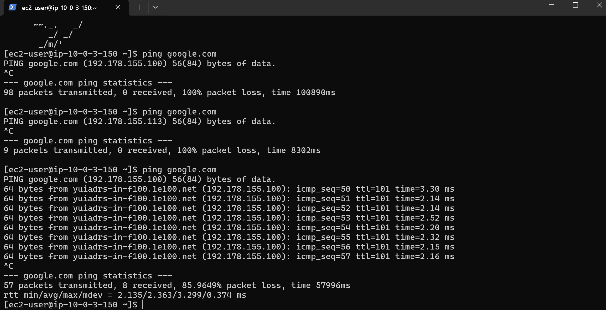

# ☁️ 01-CE: Scalable and Secure VPC Architecture

## 📖 Project Overview
This project is the first in my Cloud Engineering portfolio, demonstrating a mastery of foundational AWS networking and security constructs. I architected and deployed a highly available, multi-tier Virtual Private Cloud (VPC) from scratch, incorporating strict network segregation, routing, and stateful firewalls to mimic a secure corporate data center.

## 🏗️ Architecture Design & CCNA Mapping
The architecture was built by mapping traditional networking concepts (CCNA) directly into AWS services:

* **VPC (Virtual Private Cloud)**: The overarching private network boundary (`10.0.0.0/16`), acting as the physical corporate building.
* **Availability Zones (AZs)**: The infrastructure is distributed across two distinct AZs (Data Centers) to ensure High Availability (HA) and fault tolerance.
* **Subnets (VLANs)**:
  * **Public Subnets**: The "DMZ/Lobby" connected directly to the internet. Hosts the Bastion/Jump Box.
  * **Private Subnets**: The highly secure internal network. No direct internet access. Hosts the internal application web servers.
* **Internet Gateway (IGW)**: The enterprise edge router connecting the VPC to the ISP.
* **NAT Gateway**: Configured with Port Address Translation (PAT) in the Public Subnet, allowing private servers to securely download updates without exposing them to inbound internet traffic.
* **Route Tables**: 
  * *Public Route Table*: Includes a default route (`0.0.0.0/0`) pointing to the IGW.
  * *Private Route Table*: Includes a default route (`0.0.0.0/0`) pointing strictly to the NAT Gateway.
* **Security Groups (Stateful Firewalls / ACLs)**:
  * *Bastion SG*: Allows inbound SSH (Port 22) *only* from my specific administrator IP address.
  * *Private SG*: Allows inbound SSH *only* if the connection originates from the Bastion Security Group, establishing a secure jump-box pattern.

## 🚀 Deployment Phases
1. **Network Foundation:** Provisioned the VPC and attached the Internet Gateway.
2. **Subnetting & HA:** Created 2 Public and 2 Private Subnets spanning `us-east-1a` and `us-east-1b`.
3. **Routing:** Configured Public and Private Route Tables and associated them with the correct subnets.
4. **NAT Configuration:** Deployed a NAT Gateway with an Elastic IP for secure outbound private traffic.
5. **Security Groups:** Configured stateful Inbound/Outbound rules to enforce least-privilege access.
6. **Compute Deployment:** Launched an Amazon Linux 2023 Bastion Host and a Private Web Server.
7. **Verification:** Successfully utilized SSH Agent Forwarding (`-A`) to jump through the Bastion Host and verified private internet connectivity via the NAT Gateway.

## 📸 Proof of Work
*(Replace these placeholders with your actual screenshots)*

### 1. The Architecture Diagram
> **[TODO: Add an image of your architecture diagram here. You can draw one on draw.io or use an AWS generated one]**

### 2. Successful Jump Box (Bastion) Connection
> **[TODO: Add screenshot showing your terminal logged into the Bastion, and then jumping into the private IP]**

### 3. NAT Gateway Verification (Ping Success)
> **[TODO: Add screenshot showing the successful `ping google.com` from your private server]**

