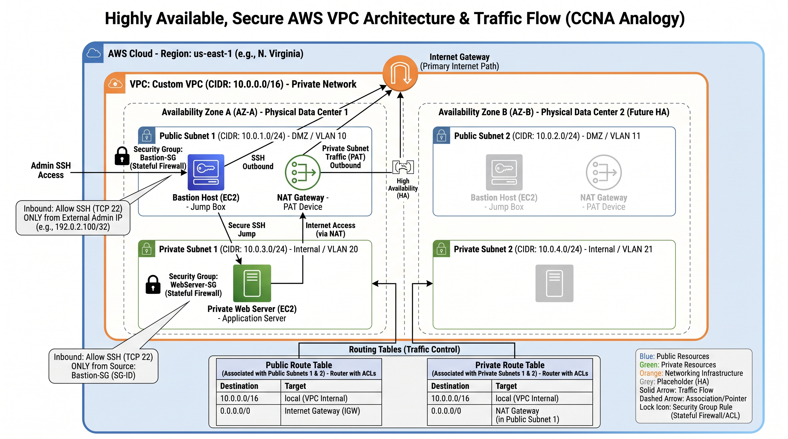

# Project 01: Scalable and Secure VPC Architecture

## Project Overview

This project demonstrates the design and implementation of a highly available, secure, and scalable network foundation on Amazon Web Services (AWS). The core objective was to build a Virtual Private Cloud (VPC) architecture from the ground up that enforces strict network segregation, minimizes the public attack surface, and ensures high availability across multiple physical data centers.

This infrastructure serves as the baseline for deploying secure enterprise applications, relying on a bastion host architecture to manage internal resources safely.

## Architecture Design

The network was architected using a multi-tier subnet strategy deployed across two Availability Zones (AZs) in the `us-east-1` region to ensure fault tolerance.

### Key Components

*   **VPC (Virtual Private Cloud):** A custom VPC was created with a `10.0.0.0/16` CIDR block, providing a logically isolated section of the AWS cloud.
*   **Availability Zones:** Resources were distributed across `us-east-1a` and `us-east-1b`.
*   **Public Subnets (DMZ):** Two public subnets (`10.0.1.0/24` and `10.0.2.0/24`) were provisioned. These subnets are configured with a route to an Internet Gateway (IGW), allowing direct inbound and outbound internet access.
*   **Private Subnets (Internal):** Two private subnets (`10.0.3.0/24` and `10.0.4.0/24`) were provisioned for application workloads. These subnets have no direct route to the internet, providing a strict security boundary.
*   **NAT Gateway:** Deployed within the public subnet to allow instances in the private subnets to securely initiate outbound traffic (e.g., for software updates) while preventing uninitiated inbound connections from the internet.
*   **Bastion Host (Jump Box):** An EC2 instance deployed in the public subnet. It acts as the single point of entry for administrators to securely SSH into instances located in the private subnets.

## Security Posture

Security is enforced at the instance level using stateful Security Groups to implement the principle of least privilege.

*   **Bastion Security Group:** Configured to allow inbound SSH (Port 22) strictly from a single, authorized administrator IP address. All other inbound traffic is denied.
*   **Private Application Security Group:** Configured to allow inbound SSH *only* if the connection originates from the Bastion Security Group. This ensures that the private servers cannot be accessed directly, even if a user bypasses the Bastion host routing.

## Validation & Testing

The infrastructure was validated through rigorous connectivity testing to ensure routing and security groups were functioning as intended.

### 1. Secure Bastion Access and Agent Forwarding
Administrator access was verified by logging into the Bastion host, and subsequently utilizing SSH Agent Forwarding (`-A`) to securely authenticate against the private application server without storing private keys on the Bastion.

### 2. Private Subnet Outbound Routing
To verify the NAT Gateway configuration, an ICMP ping was initiated from the private application server (`10.0.3.150`) to external domains. The successful response confirmed that the private route table was correctly forwarding outbound traffic through the NAT Gateway.

